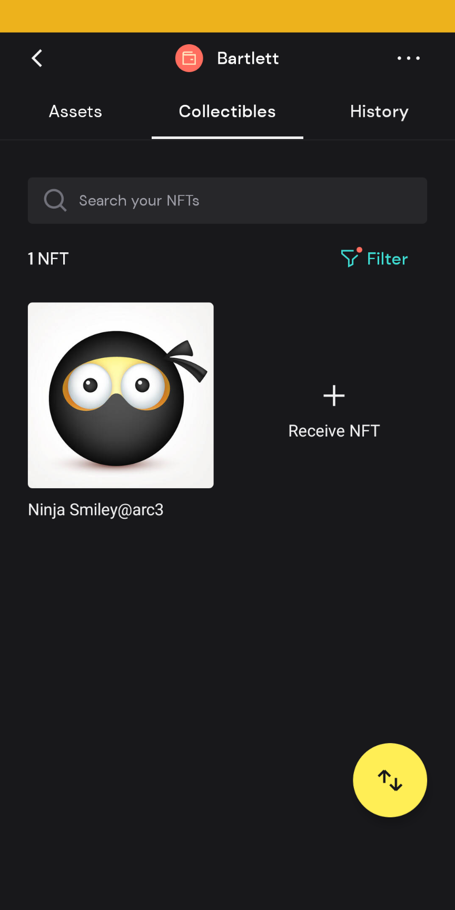

# Algorand NFTs with assets pinned to IPFS

This repo consists of a skeletal NPM project with code and dependencies described in a relevant [blog post](https://blog.genuine.com/2022/05/algorand-nfts-with-ipfs-assets/) published in May 2022.  The main snippet is a stripped-down dApp that aims to illustrate how to create [ARC3](https://github.com/algorandfoundation/ARCs/blob/main/ARCs/arc-0003.md) compliant NFTs on [Algorand](https://www.algorand.com/) with associated assets pinned to [IPFS](https://ipfs.io/).  Since it's for R&D purpose, Algorand Testnet is the target chain.

## Requirements

* [Node.js](https://nodejs.org/) installed with NPM

* An account at [Pinata](https://www.pinata.cloud/), an IPFS pinning service

* An Algorand compatible crypto wallet ([Pera](https://perawallet.app/) is preferred for the availability of a “developer” mode)

## Running the application

To run the application, git-clone this repo, open up a shell command terminals and navigate to the project-root (e.g. *algo-nft-ipfs*).

#### 1. Install dependent modules

```bash
cd algo-nft-ipfs/

npm install
```

#### 2. Provide account mnemonic and Pinata API keys (in file .env)

> Choose an account that owns some ALGO tokens (otherwise, get free tokens from a [dispenser](https://dispenser.testnet.aws.algodev.network/)) for the Algorand Testnet and place the 25-word mnemonic along with Pinata API key info in file *.env*.

```bash
# Content of file .env
mnemonic = "<my wallet's mnemonic>"
algodClientUrl = "https://node.testnet.algoexplorerapi.io"
algodClientPort = ""
algodClientToken = ""
indexerUrl = "https://algoindexer.testnet.algoexplorerapi.io"
indexerPort = ""
indexerToken = ""
pinataApiKey = "<my pinata api key>"
pinataApiSecret = "<my pinata api secret>"
```

#### 3. Provide an image file to be pinned to IPFS for the NFT

> Place an image file under the project root and modify function *createAssetOnIpfs** to provide the associated file attributes:

```javascript
const createAssetOnIpfs = async () => {
  return await pinata.testAuthentication().then((res) => {
    console.log('Pinata test authentication: ', res);
    return assetPinnedToIpfs(
      '<my image file e.g. smiley-ninja.jpg>',
      '<MIME type e.g. image/jpeg>',
      '<image name>',
      '<image description>'
    );
  }).catch((err) => {
    return console.log(err);
  });
}
```

#### 4. Mint the NFT after pinning the image file to IPFS

```bash
npm run mint
```

Upon successful minting of the NFT, the output messages will reveal the asset ID of the NFT:

```
Account <accountID> has created ARC3 compliant NFT with asset ID: <assetID>
Check it out at https://testnet.algoexplorer.io/asset/<assetID>
```

To verify receipt of the NFT from within the Pera wallet, switch to Algorand Testnet (under Settings > Developer Settings > Node Settings) and something like below will be visible in the wallet:


